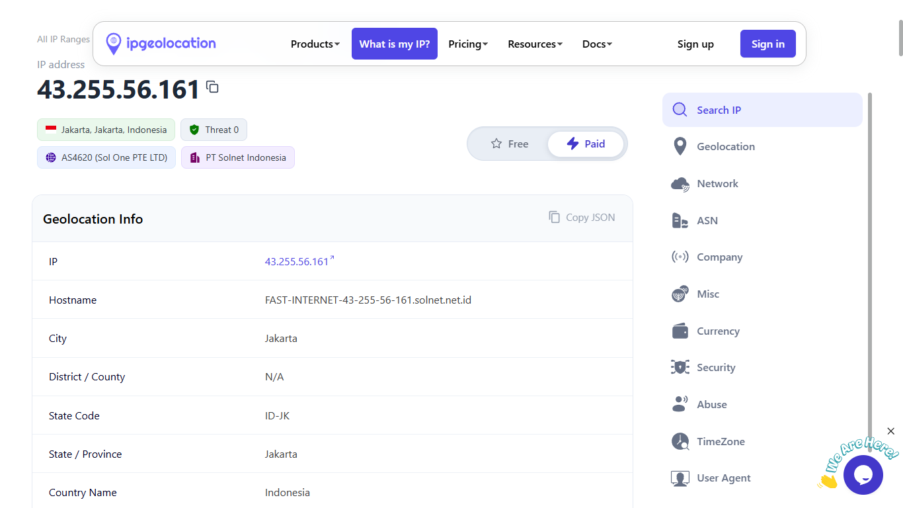
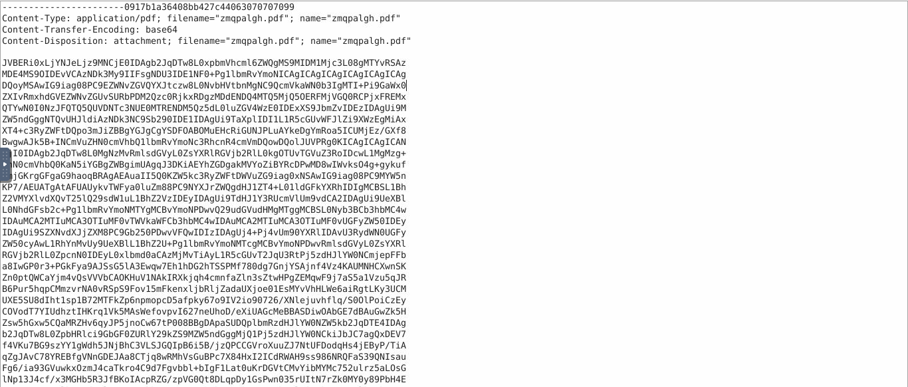
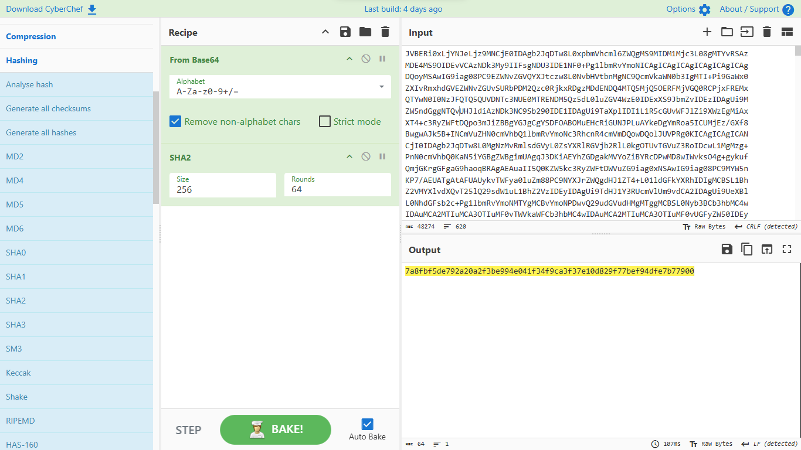
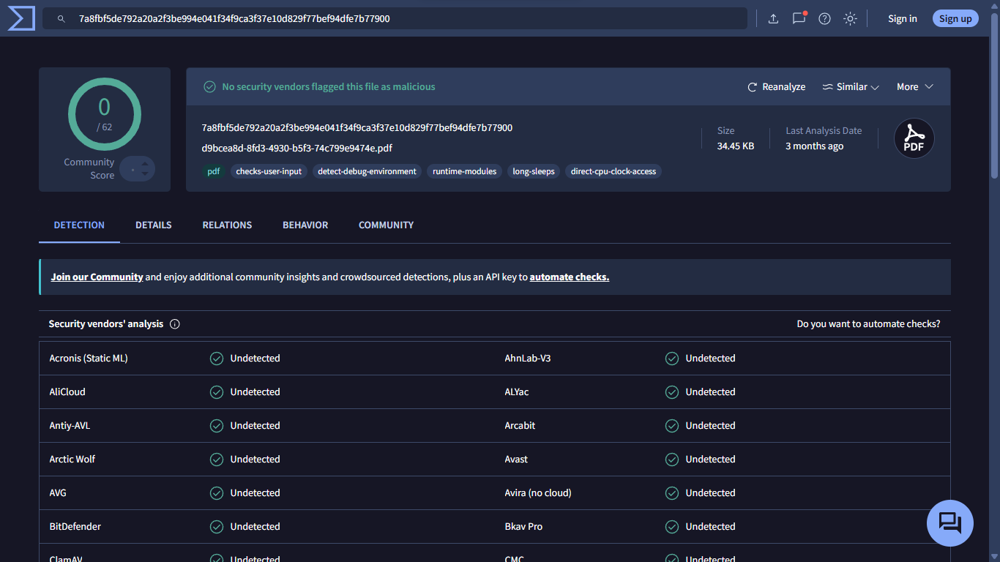

# Phishing Email Triage & Artifact Analysis Report
* **Incident / Email Date/Time** 2021-06-20 15:36:02 UTC
* **Investigation Date/Time:** 2026-09-30 13:00 UTC
* **Analyst Name:** Destiny Aremhen
* **Severity:** Low (Alert Closed)
* **Verdict:** **False Positive (Benign)**

---

## 1. Executive Summary

* **Summary:** A security alert was triggered regarding a suspicious email containing a Base64-encoded attachment. Manual artifact extraction and header triage confirmed that sender domain authentication passed (SPF/DKIM/DMARC) and the attachment was a legitimate invoice PDF falsely flagged by gateway heuristics.
* **Impact:** None. No malicious code execution, credential harvesting, or host compromise occurred.

---

## 2. Initial Alert Details

* **Source System:** Email Security Gateway
* **Sender:** `newsletters[@]ant[.]anki-tech[.]com`
* **Recipient:** `alexa[@]yahoo[.]com`
* **Subject Line:** Help protect your budget by protecting your home
* **Timestamp:** 2021-06-20 15:36:02 UTC

---

## 3. Investigation Workflow & Methodology

### Step 1: Header & Sender Infrastructure Verification
* Analyzed raw MIME headers to inspect domain alignment and transit hops:
  * **SPF:** `PASS` (Sending MTA IP matches authorized record)
  * **DKIM:** `PASS` (Cryptographic signature verified)
  * **DMARC:** `PASS`
* Extracted the `X-Originating-IP` header (`43[.]255[.]56[.]161`). Geolocation trace confirmed the IP belongs to legitimate partner infrastructure.

### Step 2: Artifact Extraction & Payload Analysis
* Extracted the Base64-encoded payload string from the email body source code.
* Utilized **CyberChef** (`From Base64`) to safely reconstruct the raw binary file stream in memory without executing it on the host system. Verified the magic byte header (`%PDF-1.6`).

* Applied cryptographic hashing (`SHA2` - 256) directly to the decoded file stream in CyberChef to obtain its unique file fingerprint.

### Step 3: Threat Intelligence Pivoting
* Queried the computed SHA-256 hash on **VirusTotal**:
  * **Detection Ratio:** `0 / 62` engines flagged the file.
  * **Verdict:** Clean / Known Benign Document.

---

## 4. Key Indicators of Compromise (IOCs) & Artifacts

| Indicator Type | Defanged Value | Status / Reputation |
| :--- | :--- | :--- |
| **Sending IP** | `43[.]255[.]56[.]161` | Clean / Legitimate Partner Range |
| **Sender Domain** | `ant[.]anki-tech[.]com` | Authenticated (SPF/DKIM/DMARC Pass) |
| **Sender Email** | `newsletters[@]ant[.]anki-tech[.]com` | Valid Sender |
| **Payload Hash (SHA-256)** | `7a8fbf5de792a20a2f3be994e041f34f9ca3f37e10d829f77bef94dfe7b77900` | Clean (0/62 Detections on VirusTotal) |

---

## 5. Verdict, Root Cause & Action Taken

* **Root Cause:** The email security gateway triggered a false positive heuristic alert on the Base64 attachment structure during transit.
* **Action Taken:**
  1. Classified ticket as **False Positive (Benign)**.
  2. Closed incident ticket without escalation.
  3. Logged the SHA-256 hash in internal notes to prevent redundant triage on future clean invoices.